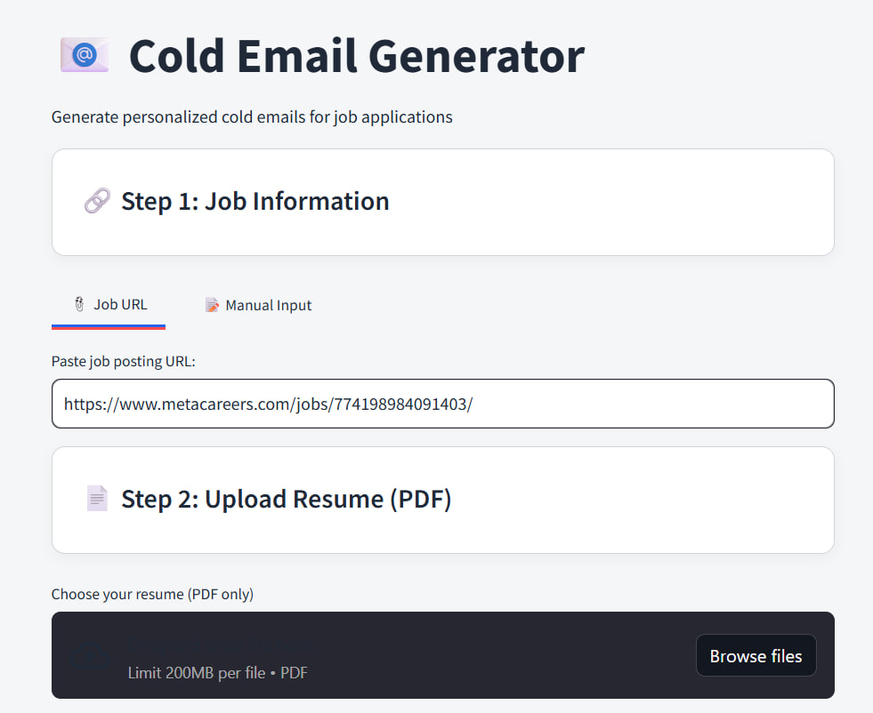
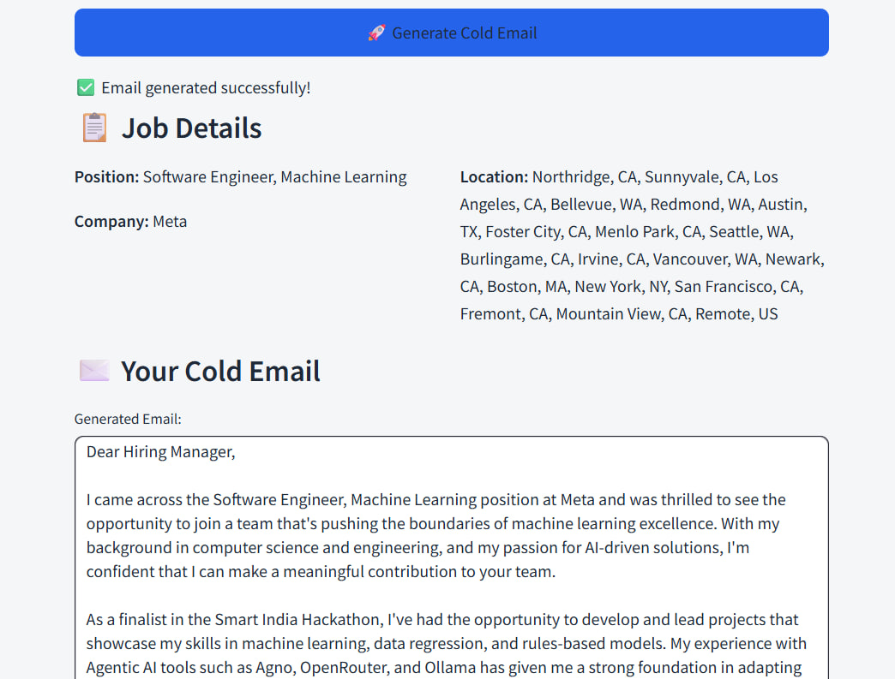
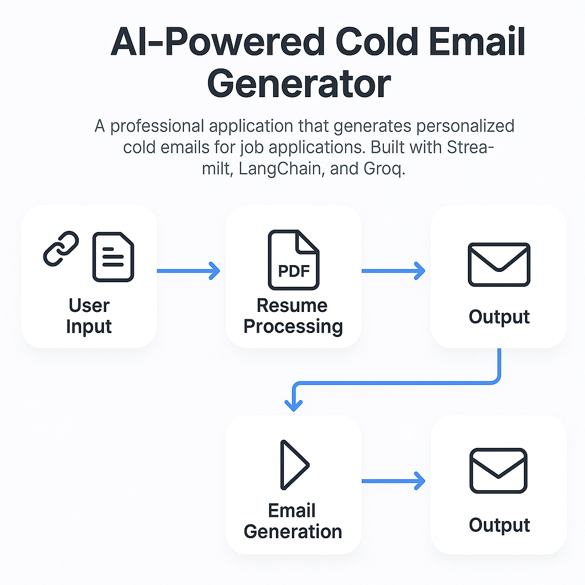

# 📧 Cold Email Generator Pro

A professional AI-powered application that generates personalized cold emails for job applications. Built with Streamlit, LangChain, and Groq AI.

## 🚀 Features

- **Smart Job Analysis**: Automatically extracts job requirements from any job posting URL
- **Resume Processing**: Analyzes uploaded PDF resumes to match relevant skills
- **Personalized Content**: Generates tailored cold emails highlighting your best qualifications
- **Professional UI**: Clean, modern interface with real-time validation
- **Multiple Formats**: Supports various job posting websites
- **Instant Generation**: Get professional emails in seconds

🎥 [Watch Demo Video](./demo.mp4)








## 🛠️ Installation

1. **Clone the repository**
   ```bash
   git clone <repository-url>
   cd cold-email-generator
   ```

2. **Install dependencies**
   ```bash
   pip install -r requirements.txt
   ```

3. **Set up environment variables**
   ```bash
   cp .env.example .env
   # Edit .env and add your GROQ_API_KEY
   ```

4. **Get your Groq API Key**
   - Visit [Groq Console](https://console.groq.com/)
   - Create an account and generate an API key
   - Add it to your `.env` file

## 🎯 Usage

1. **Start the application**
   ```bash
   streamlit run app.py
   ```

2. **Open your browser** and navigate to `http://localhost:8501`

3. **Follow the steps:**
   - Paste a job posting URL
   - Upload your resume (PDF format)
   - Add optional additional information
   - Click "Generate Cold Email"

## 📁 Project Structure

```
cold-email-generator/
├── app.py              # Main Streamlit application
├── chains.py           # LangChain processing logic
├── requirements.txt    # Python dependencies
├── .env.example       # Environment variables template
├── README.md          # Project documentation
└── .env              # Your environment variables (create this)
```

## 🔧 Technical Details

### Technologies Used
- **Streamlit**: Web application framework
- **LangChain**: LLM orchestration and chaining
- **Groq**: Fast AI inference API
- **PyMuPDF**: PDF text extraction
- **BeautifulSoup**: Web scraping for job postings

### Key Components

#### Chain Class (`chains.py`)
- `extract_jobs()`: Extracts structured job information from web content
- `write_mail()`: Generates personalized cold emails based on job and resume data

#### Streamlit App (`app.py`)
- Professional UI with custom CSS styling
- Input validation and error handling
- Progress tracking and user feedback
- Responsive design with sidebar features

## 🎨 Features Breakdown

### 1. Job Information Extraction
- Fetches content from any job posting URL
- Uses AI to extract: title, company, location, description
- Handles various website formats automatically

### 2. Resume Analysis
- Extracts text from PDF resumes
- Processes skills, experience, and qualifications
- Matches relevant information to job requirements

### 3. Email Generation
- Creates professional email templates
- Personalizes content based on job-resume matching
- Includes subject lines and proper formatting
- Maintains professional tone throughout

### 4. User Experience
- Clean, modern interface design
- Real-time input validation
- Progress indicators for long operations
- Error handling with helpful messages
- Copy-to-clipboard functionality

## 🚀 Advanced Usage

### Custom Prompts
You can modify the prompts in `chains.py` to customize:
- Email tone and style
- Information extraction format
- Content structure and length

### Supported Job Sites
The application works with most job posting websites including:
- LinkedIn Jobs
- Indeed
- Company career pages
- Job boards
- Recruitment platforms

## 🔍 Troubleshooting

### Common Issues

1. **"Error parsing JSON"**
   - Usually caused by complex job posting content
   - The app now includes fallback handling for this

2. **"Couldn't extract job details"**
   - Try a different job posting URL
   - Ensure the URL is accessible publicly

3. **"Error reading PDF"**
   - Ensure PDF is not password-protected
   - Try converting to a standard PDF format

4. **API Key Issues**
   - Verify your Groq API key is correct
   - Check if you have sufficient API credits

### Performance Tips
- Use clear, well-formatted resumes
- Provide specific additional information
- Choose job postings with detailed descriptions


## 🤝 Contributing

1. Fork the repository
2. Create a feature branch (`git checkout -b feature/AmazingFeature`)
3. Commit your changes (`git commit -m 'Add some AmazingFeature'`)
4. Push to the branch (`git push origin feature/AmazingFeature`)
5. Open a Pull Request

## 📄 License

This project is licensed under the MIT License - see the LICENSE file for details.

## 🙏 Acknowledgments

- [Streamlit](https://streamlit.io/) for the amazing web framework
- [LangChain](https://langchain.com/) for LLM orchestration
- [Groq](https://groq.com/) for fast AI inference
- The open-source community for inspiration and tools

## 📞 Support

For support, email try.bhanu2004@gmail.com or create an issue in the repository.

---

**Made with ❤️ and AI**
